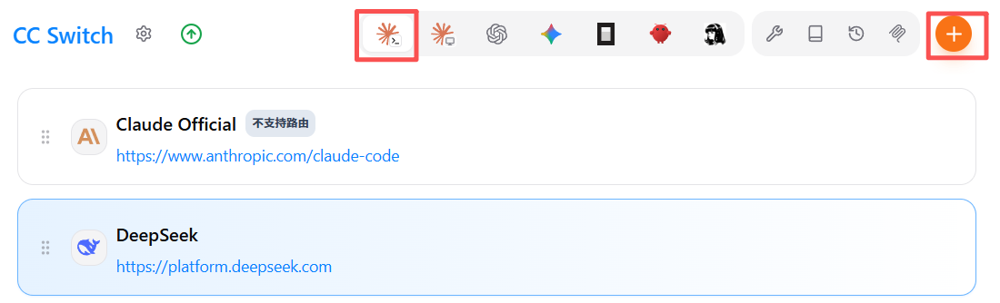

# Claude code接入Deepseek




> Claude code使用CC Swith工具选择不同的大模型：Opus/Deepseek/Kimi
> 
> 


# 运行环境准备

必要工具：Node\.js / Git / cc\-switch

## nodejs安装

直接浏览器搜索进入官网\(官网nodejs\.org，选择Windows 安装程序\)

- 确保 Node\.js 版本 ≥ 18\.0

**使用NPM配置镜像源**

国内用户不用镜像源下载比较慢，设置国内镜像源:

```Plain Text
npm config set registry https://registry.npmmirror.com
```

**验证安装**

安装完成之后请使用一下命令进行检查是否安装成功 

```Plain Text
C:\Users\User>npm -v
11.9.0

C:\Users\User>node -v
v24.14.0
```


## Git安装配置

[Git 安装配置](https://www.runoob.com/git/git-install-setup.html)

**验证安装**

在终端或命令行中运行以下命令，确保 Git 已正确安装并配置：

```Plain Text
git --version
git config --list
```


## cc\-switch安装

进入[cc\-switch官网](https://www.ccswitch.io/zh/)点击下载，跳转github，选择版本，下载 \.msi 文件


下载好了点击进行安装


# Claude code安装

1. 以管理员身份打开cmd命令提示符


2. 在bash中输入指令

```Bash
npm i -g @anthropic-ai/claude-code
```

3. 验证安装：

关闭终端重新打开，输入以下指令：

```Bash
claude --version
```

4. 打开claude code：

终端输入以下指令

```Bash
claude
```

弹出选项：

选择信任该文件夹


# Deepseek密钥申请

1. 打开Deepseek官网，进入[API开发平台](https://platform.deepseek.com/api_keys)，注册登录

2. 创建自己的api\_key，并点击**复制密钥（后续没有复制选项，只能重新创建再复制）**


3. 保证自己账户中有余额，否则后续无法正常调用（**！！！千万不要泄露自己的密钥）**


# cc\-switch接入模型

1. 打开cc\-switch选择claude code，点击右上的添加模型，选择deepseek


2. 填写自己的密钥


3. 往下滑，在模型映射中如果有1M上下文选项，勾选


4. 配置完后点击 添加 即可，在cc\-switch界面选择claude code，并启用配置的模型


5. 重新打开cmd命令提示符，输入claude启动CLI，输入以下指令

```Bash
/model
```


可以看到刚才在cc\-switch中配置的模型，点击选择自己想用的模型，回车进行选择

6. 以上claude code 接入 deepseek 模型就成功了！

# 其它模型选择

和以上步骤类似

1. 去对应官网申请api\_key

- [Kimi](https://platform.kimi.com/console/api-keys)

- [minimax](https://platform.minimaxi.com/console/access)

2. 到cc\-switch 中选择对应ai工具，点击添加填写api\_key即可

3. 后续步骤类似


# Codex工具接入国产模型

由于底层通信协议的不兼容

- Codex 客户端目前仅原生支持 OpenAI 官方的 Responses API（以及 GPT 系列模型）

- 大多数国产大模型（如 DeepSeek、Kimi、MiniMax 等）使用的是 Chat Completions 协议

故需要开启本地路由，在电脑本地启动一个轻量代理服务充当“翻译官”的角色

自动拦截请求并完成协议格式的转换，从而让国产模型能无缝接入原生工具。

否则 Codex 将无法正确解析和调用模型。


步骤如下：

1. 在添加模型时，在高级选项的上游格式中选择 Chat Completions


2. 在cc\-switch的设置中，点击路由选项，开启codex工具的路由转发


