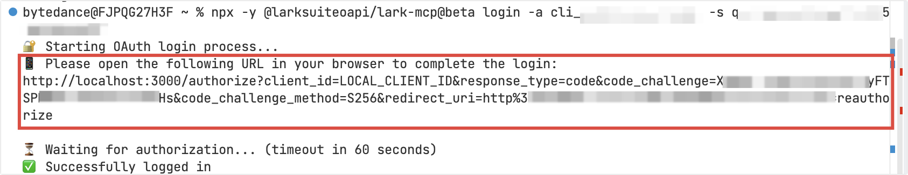

# Feishu CLI Access


> windows系统下AI接入飞书CLI
> 
> 

# 飞书CLI能做什么

飞书官方介绍如下：

[飞书 CLI 能力介绍与最佳实践](https://bytedance.larkoffice.com/wiki/ILuTww7Xcimb6GkhH0mcK2f4nS7)

我认为的：

- 相比于直接操作电脑界面，使用CLI这种终端指令Agent执行操作能够更加准确快捷

# 前置工具安装

电脑需要提前安装nodejs 和 git 软件

## nodejs安装配置

直接浏览器搜索进入官网\(官网nodejs\.org，选择Windows 安装程序\)

- 确保 Node\.js 版本 ≥ 18\.0

**使用NPM配置镜像源**

国内用户不用镜像源下载比较慢，设置国内镜像源:

```Plain Text
npm config set registry https://registry.npmmirror.com
```

**验证安装**

安装完成之后请使用一下命令进行检查是否安装成功 

```Plain Text
C:\Users\User>npm -v
11.9.0

C:\Users\User>node -v
v24.14.0
```


## Git安装配置

[Git 安装配置](https://www.runoob.com/git/git-install-setup.html)

**验证安装**

在终端或命令行中运行以下命令，确保 Git 已正确安装并配置：

```Plain Text
git --version
git config --list
```

### 

## 飞书准备

[官方教程](https://open.feishu.cn/document/mcp_open_tools/mcp-overview)

注意：若是只接入自己的飞书账户，需保证当前飞书的管理员为自己，无其它从属，检查自己账户是否有后台管理选项


**创建Feishu App**

1. 进入飞书[开发者管理终端](https://open.feishu.cn/app)，登录自己飞书账户

2. 创建客户App

3. 在应用的凭据与基本信息页面，保存凭证（App ID 和 App secret）以备后用


4. 在应用的安全设置\>重定向URL页面，重定向URLs区域输入 http://localhost:3000/callback 并点击添加。


如果页面底部有刷新率user\_access\_token开关，你需要开启它。

如果没有这样的开关，则无需操作，因为它默认已启用。


5. 完成配置后，发布应用程序以使配置生效


# 飞书配置

[飞书CLI安装指南](https://open.feishu.cn/document/no_class/mcp-archive/feishu-cli-installation-guide.md)

1. 安装：打开用户终端输入以下指令

```Bash
# Install CLI
npm install -g @larksuite/cli

# Install CLI SKILL (Required)
npx -y skills add https://open.feishu.cn --skill -y
```

2. 配置app凭证

```Bash
lark-cli config init --new
```

3. 登录账户并授权开通功能，按住ctrl访问链接

```Bash
lark-cli auth login --recommend
```

4. 验证

```Bash
lark-cli auth status
```


# Agent工具接入

1. 在 claude code 或者 Trae 终端输入：

```Bash
# 替换为自己的app_id 和 app_secret
npx -y @larksuiteoapi/lark-mcp login -a <your_app_id> -s <your_app_secret>
```

2. 终端会回响用户授权的URL，你需要在60秒内访问并完成授权



3. 如果是Trae或Codex或workBuddy等桌面端，可以从MCP入口手动添加，在json格式配置文件中将默认内容替换为以下 JSON 并点击确认（注意替换app\_id和app\_secret\)

```JSON
{
  "mcpServers": {
    "lark-mcp": {
      "command": "npx",
      "args": [
        "-y",
        "@larksuiteoapi/lark-mcp",
        "mcp",
        "-a",
        "<your_app_id>",
        "-s",
        "<your_app_secret>",
        "--oauth"
      ]
    }
  }
}
```

4. 配置好后可以看到feishu工具的状态为绿色即可正常使用

5. 验证，在聊天框中输入以下内容

```Bash
使用飞书工具将我有编辑权限的云文档列出并整理进新的云文档中
```

如提示缺少相关权限，如：

```Bash
搜索/列表（未授权）
缺 search:docs:read
缺 space:document:retrieve
```

直接在终端输入

```Bash
lark-cli auth login --scope "search:docs:read"
lark-cli auth login --scope "space:document:retrieve"
```

会弹出授权链接，按照ctrl点击链接进行授权即可。

