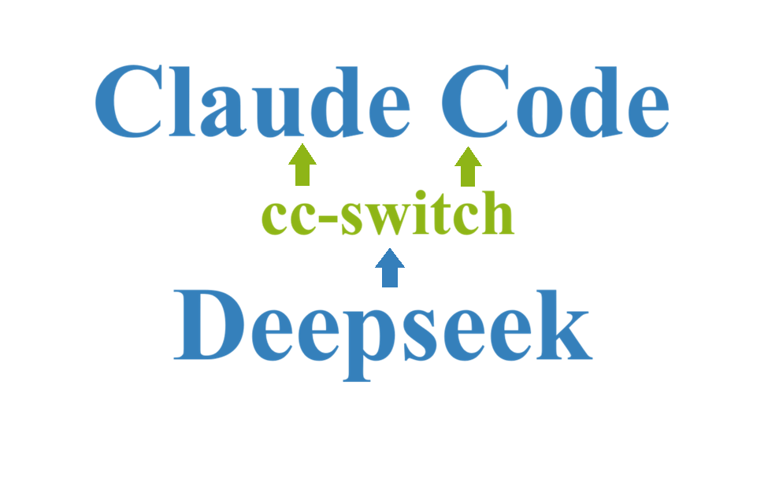
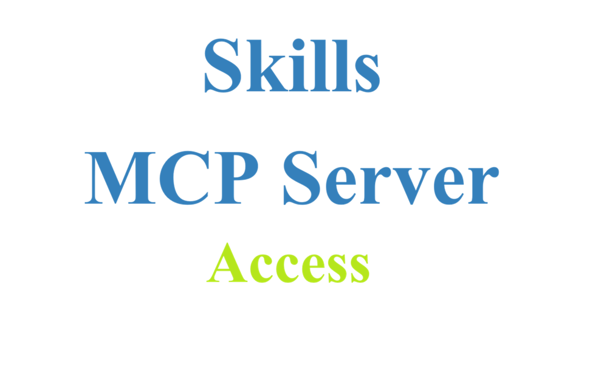
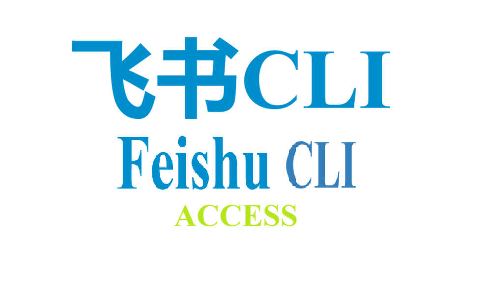

# AI_Agent_Tools_Album

This repository mainly records the configuration manuals for different AI tools, such as Skills, MCP Servers, and more. Hope it helps you!

---

## Table of Contents

1. **Claude Code Connects DeepSeek Model via cc-switch**
   
   You will also learn how to connect other models (e.g., Kimi, MiniMax) and configure Codex tools.
   
   
   
   👉 Follow the detailed instruction: [Claude code Connect Deepseek.md](./Claude%20code%20Connect%20Deepseek.md)

2. **Skills & MCP Server Installation**
   
   You will learn the differences between these two concepts, along with a list of useful and popular Skills/MCP servers worth trying.
   
   
   
   👉 Follow the detailed instruction: [Skills_MCP Server Access.md](./Skills_MCP%20Server%20Access.md)

3. **Feishu CLI Installation**
   
   *100% Recommended!* You will learn how to set up the Feishu CLI app and install its relevant skills.
   
   
   
   👉 Follow the detailed instruction: [Feishu CLI Access.md](./Feishu%20CLI%20Access.md)
